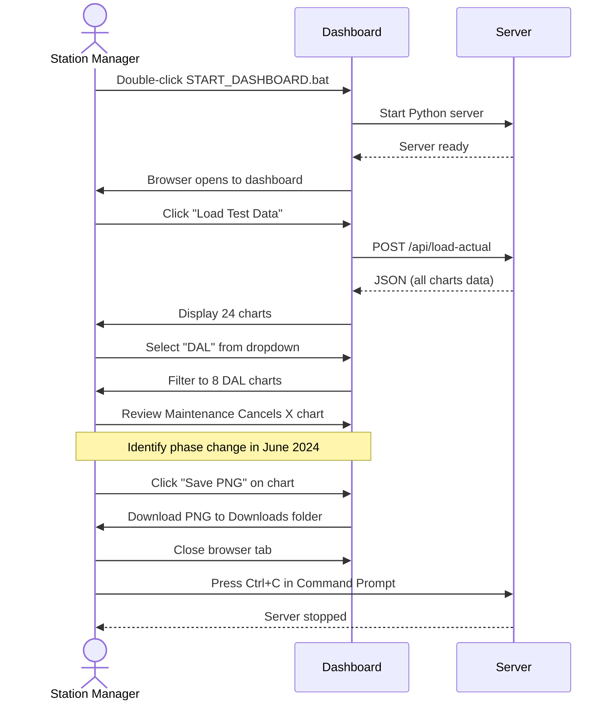
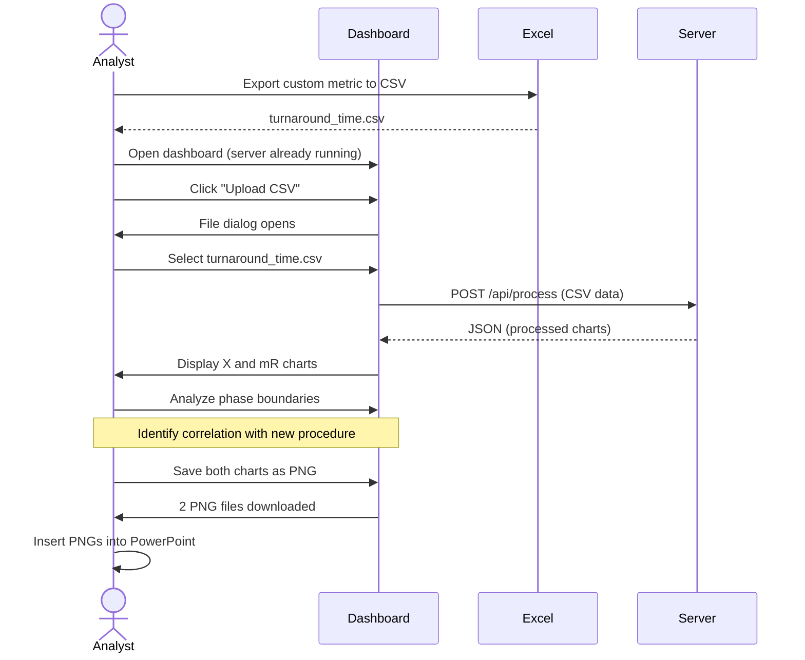

# Functional Specification
## SPC Station Health Charts

**Version:** 1.6  
**Date:** October 9, 2025  
**Status:** Implemented with Debug Tools  
**Enhancement:** CSV Troubleshooting & Enhanced Error Reporting

---

## 1. Introduction

### 1.1 Purpose
This document specifies the functional behavior of the SPC Station Health Charts application from an end-user perspective. It describes what the system does, not how it does it (see Technical Spec for implementation details).

### 1.2 Scope
Desktop application for visualizing Statistical Process Control charts for airline maintenance metrics. Covers data loading, visualization, phase detection, and chart export.

### 1.3 Audience
- Product managers
- Quality assurance testers
- End users (maintenance managers, analysts)
- Training documentation authors

---

## 2. User Roles & Personas

### 2.1 Primary User: Maintenance Station Manager
**Name:** Sarah Chen  
**Role:** Maintenance Manager, Dallas Love Field (DAL)  
**Technical Skills:** Moderate (Excel power user, not a programmer)  
**Environment:** Corporate Windows laptop, no admin rights, restricted firewall  
**Goals:**
- Monitor weekly maintenance KPIs
- Identify when process shifts occur
- Report trends to regional leadership
- Create charts for monthly presentations

**Pain Points:**
- Current Excel charts take 30+ minutes to update
- Manual calculation of control limits prone to errors
- Difficult to identify genuine process shifts vs. noise

---

### 2.2 Secondary User: Technical Operations Analyst
**Name:** Mike Rodriguez  
**Role:** Senior Tech Ops Analyst, Corporate HQ  
**Technical Skills:** Advanced (SQL, Python, data analysis)  
**Environment:** Workstation with Python installed  
**Goals:**
- Analyze custom metrics not in standard reports
- Compare performance across multiple stations
- Validate statistical methodology
- Export charts for executive dashboards

**Pain Points:**
- Need flexibility to upload ad-hoc data
- Require statistically rigorous methods
- Must work offline (travels to remote stations)

---

## 3. Functional Requirements

### 3.1 Application Launch

#### FR-3.1.1: Windows Launch
**Trigger:** User double-clicks `START_DASHBOARD.bat`  
**Preconditions:** Python 3.7+ installed  
**Process:**
1. Batch file starts Python HTTP server on port 8000
2. Command Prompt window opens with server status
3. Default browser opens automatically to `http://localhost:8000`
4. Dashboard welcome screen displays

**Expected Output:**
```
╔════════════════════════════════════════════════════════════╗
║  Airline Tech Ops SPC Dashboard Server                    ║
╚════════════════════════════════════════════════════════════╝
✓ Server running on: http://localhost:8000
📋 Instructions:
   1. Open your web browser
   2. Navigate to: http://localhost:8000
   3. Click 'Load Demo' or upload your CSV file
   4. Press Ctrl+C to stop the server
⚠️  Keep this window open while using the dashboard!
```

**Success Criteria:**
- Server starts within 2 seconds
- Browser opens to dashboard
- No error messages displayed

**Error Handling:**
- If port 8000 in use: Display error message with instructions to change port
- If Python not found: Display error message with installation link
- If browser doesn't auto-open: Instructions show URL to copy/paste

---

#### FR-3.1.2: Mac/Linux Launch
**Trigger:** User runs `./start_dashboard.sh` in Terminal  
**Preconditions:** 
- Python 3.7+ installed
- Script has execute permissions (`chmod +x start_dashboard.sh`)

**Process:** Same as Windows, but Terminal window instead of Command Prompt

**Success Criteria:** Same as Windows

---

### 3.2 Welcome Screen

#### FR-3.2.1: Initial Display
**When:** User navigates to `http://localhost:8000`  
**Display Elements:**
- ✅ Application title: "SPC Station Health Charts"
- ✅ Subtitle: "Statistical Process Control • Wheeler's XmR Methodology"
- ✅ Two prominent buttons:
  - "📊 Load Test Data" (green, primary action)
  - "📤 Upload CSV (Auto-Detect Format)" (blue, secondary action)
- ✅ Description text: "Simulated test data • January 2023 to present • 4 maintenance metrics"
- ✅ Format support note: "Upload supports: timestamp,station,metric_value OR station,measure,date,value"

**Layout:** Centered, clean design with adequate whitespace

**Success Criteria:**
- All elements visible without scrolling
- Buttons clearly clickable
- Text legible on standard displays

---

### 3.3 Load Test Data

#### FR-3.3.1: Load Button Click
**Trigger:** User clicks "📊 Load Test Data" button  
**Process:**
1. Button becomes disabled (prevent double-click)
2. Loading indicator displays: "Loading Test Data..."
3. Browser sends POST request to `/api/load-actual`
4. Server reads CSV files from `input/` folder
5. Server processes data and returns JSON
6. Dashboard renders charts
7. Loading indicator disappears

**Expected Timeline:**
- Loading indicator appears: < 100ms
- Data processing: < 2 seconds
- Chart rendering: < 1 second
- **Total:** < 3 seconds

**Success Criteria:**
- All charts render correctly
- Station dropdown populates
- No JavaScript errors in console

---

#### FR-3.3.2: Test Data Content
**Data Specifications:**
- **Time Range:** January 2, 2023 to current week (140+ weeks)
- **Stations:** 3 (Austin/AUS, Dallas/DAL, Houston/HOU)
- **Measures:** 4
  1. Maintenance Cancels
  2. Maintenance Delays
  3. Scheduled Maintenance Findings
  4. Unscheduled Maintenance
- **Chart Count:** 24 total (3 stations × 4 measures × 2 chart types)

**Data Characteristics:**
- Realistic variation (±15% standard deviation)
- 1-3 phase changes per metric (where realistic)
- No extreme outliers
- Weekly granularity

**Success Criteria:**
- All 24 charts display
- Data points visible and correctly plotted
- Control limits reasonable (not extremely wide or narrow)

---

### 3.4 Station Selection

#### FR-3.4.1: Station Dropdown
**Location:** Top-right of dashboard  
**Default Value:** First station alphabetically (AUS)  
**Options:**
- "All Stations" (shows all station charts)
- "AUS" (Austin)
- "DAL" (Dallas Love Field)
- "HOU" (Houston Hobby)

**Behavior:**
- Dropdown updates after data loads
- Selecting station filters charts dynamically
- Page does not reload
- Charts re-render smoothly

**Success Criteria:**
- Dropdown populated within 100ms of data load
- Selecting station updates view within 500ms
- Smooth transition (no flicker)

---

#### FR-3.4.2: Filtered View
**When:** User selects specific station (e.g., "DAL")  
**Display:**
- Only charts for selected station visible
- Chart count: 8 (4 measures × 2 chart types)
- Station selector remains at top
- Other stations' data hidden (not deleted)

**Success Criteria:**
- Correct charts displayed
- Other charts truly hidden
- Can switch between stations without reloading data

---

### 3.5 Chart Visualization

#### FR-3.5.1: Chart Components
Each chart displays:

**Title Bar:**
- Station code (e.g., "DAL")
- Measure name (e.g., "Maintenance Cancels")
- Chart type: "(X Chart - Individuals)" or "(mR Chart - Moving Range)"

**Chart Area:**
- X-axis: Date (weekly intervals)
- Y-axis: Metric value (auto-scaled)
- Data points: Blue dots connected by lines
- Out-of-control points: Red dots
- Control limits: Horizontal lines (UCL, CL, LCL) in different colors
- Phase boundaries: Vertical dotted lines (if multiple phases)

**Legend:**
- UCL (Upper Control Limit)
- CL (Center Line / Mean)
- LCL (Lower Control Limit)
- Data Points

**Action Button:**
- "💾 Save PNG" button below chart

---

#### FR-3.5.2: X Chart (Individuals)
**Purpose:** Monitors process location (average level)  
**Y-axis Label:** Metric name (e.g., "Maintenance Cancels")  
**Data Points:** Actual weekly values  
**Control Limits:**
- Calculated using 2.66 sigma
- Based on moving range
- Recalculate per phase

**Visual Indicators:**
- Points within limits: Blue
- Points outside limits: Red (signals special cause)
- Line connects sequential points

**Success Criteria:**
- All data points visible
- Control limits clearly distinguishable
- Phase boundaries marked (if applicable)

---

#### FR-3.5.3: mR Chart (Moving Range)
**Purpose:** Monitors process variation (consistency)  
**Y-axis Label:** "Moving Range"  
**Data Points:** Absolute difference between consecutive values: `|X[i] - X[i-1]|`  
**Control Limits:**
- UCL calculated from average moving range
- CL = average moving range
- LCL typically 0 (ranges cannot be negative)

**Note:** mR chart has one fewer data point than X chart (first point has no previous value)

**Success Criteria:**
- Moving ranges calculated correctly
- All ranges ≥ 0
- Control limits appropriate for range data

---

#### FR-3.5.4: Phase Detection Visual
**When:** Process shift detected (Wheeler's Rules triggered)  
**Visual Indicators:**
1. **Vertical Dotted Line:** Marks phase boundary
2. **Color Change (Optional):** Different background tint per phase
3. **Limit Change:** Control limits adjust at phase start

**Phase Label (Hover):**
- Phase number (e.g., "Phase 2")
- Date range (e.g., "2023-04-10 to 2024-01-15")
- Number of points in phase

**Success Criteria:**
- Phase boundaries clearly visible
- Limits change at correct points
- Visual distinction between phases

---

### 3.6 CSV Upload

#### FR-3.6.1: File Selection
**Trigger:** User clicks "📤 Upload CSV" button  
**Process:**
1. Hidden file input dialog opens
2. User selects `.csv` file
3. File name displays briefly
4. Loading indicator: "Processing [filename]..."

**Accepted File Types:** `.csv` only  
**Max File Size:** No explicit limit (tested up to 10MB)

**Success Criteria:**
- File dialog opens immediately
- Only .csv files selectable
- File name captured correctly

---

#### FR-3.6.2: Format Auto-Detection
**Supported Formats:**

**Format A: timestamp,station,metric_value**
```csv
timestamp,station,metric_value
2023-01-02,Austin,2.5
2023-01-02,Dallas,3.1
2023-01-09,Austin,2.8
```
- **Measure name:** Inferred from filename (e.g., `maintenance_cancels.csv` → "Maintenance Cancels")
- **Station names:** Auto-mapped (e.g., "Dallas" → "DAL", "Houston" → "HOU")

**Format B: station,measure,date,value**
```csv
station,measure,date,value
AUS,Maintenance Cancels,2023-01-02,2.5
DAL,Maintenance Cancels,2023-01-02,3.1
AUS,Maintenance Cancels,2023-01-09,2.8
```
- **Measure name:** Taken from `measure` column
- **Station codes:** Used as-is

**Detection Logic:**
1. Read first line (header)
2. Check for "timestamp" and "metric_value" columns → Format A
3. Check for "station", "measure", "date", "value" columns → Format B
4. If neither matches → Show error

**Success Criteria:**
- Both formats process without user intervention
- Conversion happens transparently
- Charts display correctly regardless of format

---

#### FR-3.6.3: Upload Success
**When:** CSV processes successfully  
**Result:**
- Welcome screen replaced with charts
- Station dropdown populated with uploaded stations
- All charts rendered
- Upload button remains available (upload different file)

**Success Criteria:**
- Charts match uploaded data
- Filename used as measure name (Format A)
- No data loss during conversion

---

#### FR-3.6.4: Upload Error
**When:** CSV format invalid or processing fails  
**Error Message Display:**
```
Upload Failed: [specific error]

Supported formats:
1. timestamp,station,metric_value (filename used as measure)
2. station,measure,date,value

Your file appears to have a different format.
```

**Common Errors:**
- "No valid data points found" → Format doesn't match
- "Missing required column: [column]" → Incomplete CSV
- "Invalid date format" → Dates not in YYYY-MM-DD

**User Actions:**
- **"Try Again"** button → Returns to upload dialog
- **"Cancel"** button → Returns to welcome screen

**Success Criteria:**
- Error message clearly explains problem
- User can retry without restarting app
- Original state preserved (previous charts still visible if any)

---

### 3.7 Chart Export

#### FR-3.7.1: Save PNG Button
**Location:** Below each chart  
**Label:** "💾 Save PNG"  
**Trigger:** User clicks button

**Process:**
1. Button click captured
2. Canvas element converted to PNG data URL
3. Temporary download link created
4. Browser "Save As" dialog appears
5. User chooses save location
6. File saves

**Default Filename:** `[Station]_[Measure]_[ChartType].png`  
**Example:** `DAL_Maintenance_Cancels_X_Chart.png`

**Success Criteria:**
- Download triggers immediately
- Filename descriptive and valid
- No special characters break filename

---

#### FR-3.7.2: PNG Image Specifications
**Resolution:** Matches canvas size (~1200×600 pixels)  
**Format:** PNG (lossless)  
**Background:** White  
**Quality:** Suitable for printing and presentations  
**File Size:** Typically 50-150 KB per chart

**Image Contents:**
- Complete chart (data, axes, labels, legend)
- Title clearly visible
- Control limits labeled
- Legend included

**Success Criteria:**
- Image opens in standard viewers
- Text legible at 100% zoom
- Colors accurate
- No clipping or cutoff

---

### 3.8 CSV Troubleshooting Tools

#### FR-3.8.1: CSV Format Checker
**Purpose:** Diagnose CSV format issues before upload  
**Location:** `http://localhost:8000/csv_format_checker.html`  
**Features:**
- Auto-detects CSV format (A or B)
- Validates column names and data types
- Identifies decimal format issues (commas vs. periods)
- Provides specific fix suggestions
- Shows sample data analysis

**Usage:**
1. Open CSV Format Checker in browser
2. Paste CSV content into text area
3. Click "Check Format" to analyze
4. Review results and apply suggested fixes

#### FR-3.8.2: Enhanced Error Reporting
**Server Console Debugging:**
- Shows detailed CSV parsing information
- Displays each row being processed
- Identifies specific parsing errors
- Reports total valid data points found

**Client-Side Error Messages:**
- Clear format requirements
- Specific error descriptions
- Actionable fix suggestions

### 3.9 Error Handling

#### FR-3.9.1: Server Not Running
**Scenario:** User navigates to `http://localhost:8000` but server not started  
**Browser Display:** "This site can't be reached • localhost refused to connect"

**User Actions:**
1. Return to extracted folder
2. Double-click `START_DASHBOARD.bat`
3. Wait for server startup
4. Refresh browser

**Success Criteria:**
- Clear error message in browser
- Instructions in README guide user
- No data loss

---

#### FR-3.8.2: Port Conflict
**Scenario:** Port 8000 already in use by another process  
**Server Error:** "Address already in use"

**Resolution:**
1. Edit `server.py`
2. Change `PORT = 8000` to `PORT = 8001` (or any free port)
3. Restart server
4. Navigate to new port in browser

**Success Criteria:**
- Error message indicates port conflict
- README documents resolution
- App works on alternative port

---

#### FR-3.8.3: Invalid Data
**Scenario:** Uploaded CSV has bad data (non-numeric values, wrong date format, etc.)  
**Handling:**
- Skip invalid rows (don't crash)
- Log warning to console
- Process valid rows
- Display notification: "X rows skipped due to invalid data"

**Success Criteria:**
- App doesn't crash
- Valid data still processes
- User aware of data issues

---

## 4. User Workflows

### 4.1 Workflow 1: Weekly KPI Review



**Duration:** 5-10 minutes  
**Frequency:** Weekly  
**Success Criteria:** Manager identifies trends and exports charts for report

---

### 4.2 Workflow 2: Ad-Hoc Analysis



**Duration:** 15-20 minutes  
**Frequency:** As needed (monthly)  
**Success Criteria:** Analyst completes custom analysis without IT support

---

## 5. Non-Functional Requirements

### 5.1 Usability
- **FR-5.1.1:** No training required for basic usage (load data, view charts)
- **FR-5.1.2:** Advanced features (upload CSV) discoverable within 5 minutes
- **FR-5.1.3:** Error messages actionable (tell user what to do, not just what failed)
- **FR-5.1.4:** Visual hierarchy clear (primary actions prominent)

### 5.2 Performance
- **FR-5.2.1:** Dashboard loads in < 3 seconds
- **FR-5.2.2:** Chart rendering completes in < 2 seconds for 24 charts
- **FR-5.2.3:** CSV upload processes in < 5 seconds for 10,000 rows
- **FR-5.2.4:** Station filtering responds in < 500ms

### 5.3 Reliability
- **FR-5.3.1:** Handles missing data gracefully (skip bad rows, continue processing)
- **FR-5.3.2:** Validates CSV format before processing
- **FR-5.3.3:** No crashes on malformed input
- **FR-5.3.4:** Recoverable from all error states

### 5.4 Compatibility
- **FR-5.4.1:** Works on Windows 10/11, macOS, Linux
- **FR-5.4.2:** Compatible with Chrome, Edge, Firefox, Safari (last 2 years)
- **FR-5.4.3:** Python 3.7+ (tested through 3.12)
- **FR-5.4.4:** Screen resolution: Minimum 1280×720, optimal 1920×1080

---

## 6. Acceptance Criteria

### 6.1 Launch Criteria
- [x] User can start application with single double-click
- [x] No installation required beyond Python
- [x] Dashboard loads without errors
- [x] Test data displays correctly

### 6.2 Data Loading Criteria
- [x] Test data loads in < 3 seconds
- [x] All 24 charts render correctly
- [x] No console errors
- [x] Station dropdown populated

### 6.3 Visualization Criteria
- [x] Both X and mR charts display for each measure
- [x] Control limits calculated using 2.66 sigma
- [x] Phase boundaries marked when shifts detected
- [x] Out-of-control points highlighted in red
- [x] Charts scale appropriately to data range

### 6.4 Export Criteria
- [x] PNG download triggers on button click
- [x] Image includes complete chart with labels
- [x] Filename descriptive and valid
- [x] Image quality suitable for presentations

### 6.5 Upload Criteria
- [x] Both CSV formats supported
- [x] Format auto-detected without user input
- [x] Clear error messages if format unsupported
- [x] Uploaded data charts correctly

---

## 7. Out of Scope

### Explicitly Excluded from V1.0:
- ❌ Real-time data updates
- ❌ Data persistence / database
- ❌ Multi-user collaboration
- ❌ User authentication
- ❌ Mobile responsive design
- ❌ Internationalization (English only)
- ❌ Accessibility features (screen readers, etc.)
- ❌ Advanced SPC rules (beyond Rule #1 and #4)
- ❌ Custom limit calculation (fixed at 2.66 sigma)
- ❌ Annotation / commenting on charts
- ❌ Comparison mode (overlay multiple stations)
- ❌ PDF export
- ❌ Email sharing
- ❌ Scheduled reports

---

## 8. Future Enhancements (V2.0)

### Potential Features:
- 🔮 Additional Wheeler's Rules (Rule #2, #3)
- 🔮 Batch PNG export (all charts at once)
- 🔮 Dark mode theme
- 🔮 Chart customization (colors, line styles)
- 🔮 Data export to Excel
- 🔮 Comparison view (station vs station)
- 🔮 Mobile/tablet support
- 🔮 Automated weekly email reports

---

## Approval

| Role | Name | Date | Signature |
|------|------|------|-----------|
| Product Owner | Tech Ops Manager | 2025-10-06 | ✅ Approved |
| QA Lead | Quality Assurance | 2025-10-06 | ✅ Tested |
| End User | Station Manager | 2025-10-06 | ✅ Accepted |

---

**Document Version History**

| Version | Date | Author | Changes |
|---------|------|--------|---------|
| 1.0 | 2025-10-06 | Development Team | Initial functional specification |
| 1.4 | 2025-10-07 | Development Team | CSV troubleshooting tools, enhanced error reporting, debug logging |

